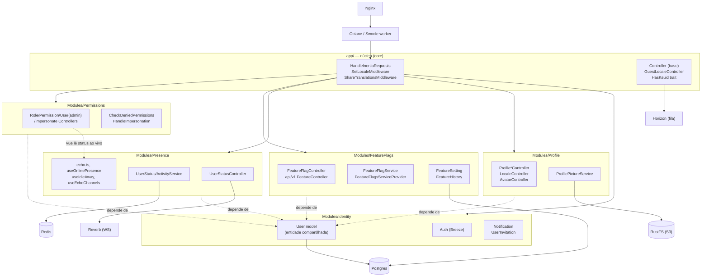
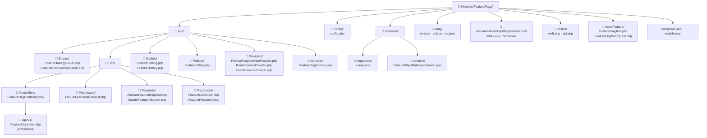
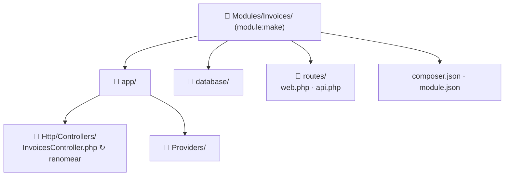
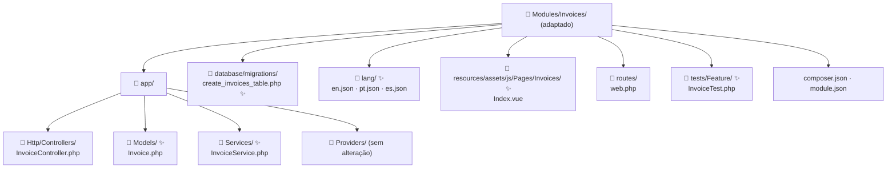

# Arquitetura modular

Todo o código de domínio deste boilerplate vive em `Modules/`, um módulo por
domínio de negócio, gerenciado pelo pacote [`nwidart/laravel-modules`](https://laravelmodules.com/).
Não é opcional nem um extra — é a forma como o projeto é organizado.

**Por quê.** Numa empresa onde vários times mexem em domínios diferentes ao
mesmo tempo, uma estrutura tradicional `app/Models`, `app/Http/Controllers`
faz com que qualquer feature nova toque nos mesmos arquivos compartilhados
(`lang/en.json`, `routes/web.php`, seeders) — e isso vira conflito de merge
garantido. Módulos isolam cada domínio na sua própria pasta: dois times
trabalhando em domínios diferentes praticamente nunca tocam no mesmo arquivo.

Para as regras exatas (o que pode depender do quê, convenções de nomenclatura,
etc.), veja a seção "Modules" do [AGENTS.md](AGENTS.md) — este documento aqui
é a versão explicada, aquele é a referência rápida.

## Os módulos hoje

| Módulo | Responsabilidade |
|---|---|
| **Identity** | Model `User`, autenticação (Breeze), notificações e convite por e-mail |
| **Profile** | Edição do próprio perfil, foto/avatar, idioma preferido |
| **Presence** | Status online/away/busy, log de atividade, canais realtime (Reverb) |
| **FeatureFlags** | Feature flags (Pennant), estratégias de rollout, API pública `/api/v1/features` |
| **Permissions** | RBAC (Spatie), gestão de usuários pelo admin, impersonate |

## Visão geral



## O que fica em `app/` (o núcleo)

Só o que não pertence a nenhum domínio específico:

- `HandleInertiaRequests`, `SetLocaleMiddleware`, `ShareTranslationsMiddleware`
- `Controller` (classe base), `GuestLocaleController`
- `HasKsuid` (trait usada por todos os models)
- `AppServiceProvider`, `EventServiceProvider`, `HorizonServiceProvider`

Se algo é usado por exatamente um domínio, é módulo. Se é lido ou estendido
por todos os módulos, é núcleo — e adicionar coisa ao núcleo deve ser raro,
já que é o único lugar em que todo mundo que mantém um módulo precisa
concordar.

## A única dependência entre módulos permitida

Todo módulo pode depender de `Identity` para usar o model `User`
(`Modules\Identity\Models\User`) e do `HasKsuid` do núcleo. Nenhuma outra
dependência módulo-a-módulo no PHP é permitida — se sua feature precisa do
model ou serviço de outro módulo, ou a fronteira está errada, ou aquilo
deveria estar em `Identity`/núcleo.

No front-end (Vue) a regra é mais solta: componentes do núcleo
(`AuthenticatedLayout.vue`) importam componentes de módulo via o alias
`@modules` do Vite, e a tela de admin de um módulo pode ler o estado
exportado por outro para uma necessidade genuinamente transversal — a lista
de usuários do Permissions lendo o status online/offline ao vivo do Presence
é o exemplo que já existe hoje. Isso é leitura de estado de front-end, não
acoplamento de back-end, e por isso é aceito.

## Como é uma pasta de módulo por dentro

Cada módulo espelha o formato do `app/` raiz — nada de controller, model e
service soltos juntos na mesma pasta. Exemplo real, `Modules/FeatureFlags/`:



## Rotas

Cada módulo tem seu próprio `RouteServiceProvider`, que carrega
`routes/web.php`/`routes/api.php` automaticamente — nada pra registrar em
`bootstrap/app.php`. Se o arquivo de rotas já declara seu próprio
`Route::middleware([...])->group(...)`, o `map()` do provider usa
`$this->loadRoutesFrom(...)` direto, em vez do wrapper padrão do pacote (que
reaplicaria o grupo `web`/`api` por cima, duplicando middleware).

## Traduções

Cada módulo tem `lang/{en,pt,es}.json`. O tradutor do Laravel funde todos
esses arquivos numa única tabela indexada pela frase em inglês — então
`__('Salvar recurso')` funciona igual, esteja a chave em `lang/en.json` da
raiz ou em `Modules/FeatureFlags/lang/en.json`. **Nunca** use sintaxe
`modulo::chave`. Uma chave só vai pra raiz se 2+ módulos usarem a mesma
string literal (`Save`, `Cancel`, mensagens de validação genéricas).

Ponto de atenção: `ShareTranslationsMiddleware` (que manda as traduções pro
front-end via prop do Inertia) **não** usa o tradutor do Laravel — ele lê os
arquivos JSON direto do disco, por isso funde manualmente a raiz +
`Module::allEnabled()` ele mesmo. Se um dia mudar como as traduções chegam
no front, lembre que esse segundo merge existe e não é automático.

## Criando um módulo novo

```bash
php artisan module:make Invoices
```

Por padrão o gerador assume um módulo Blade/Mix (`vite.config.js`,
`resources/assets/js/app.js`, `resources/views/index.blade.php`) — como este
app é só Inertia, num Vite compartilhado, isso nunca serviria pra nada.
`config/modules.php`'s `generator.stubs.files` já vem cortado pra não gerar
mais nada disso, então o que sai do comando já é só o necessário:



Só o controller placeholder (nome no plural, gerado pelo `module:make-controller`
interno) costuma valer a pena renomear. Daí é só completar com o que a
feature precisa:



(✨ = novo para esta feature; o resto veio pronto do scaffold)

Passos práticos:

1. `php artisan module:make <Nome>`
2. Renomeie o controller placeholder se o nome gerado (plural) não servir
3. Vue fica em `resources/assets/js/Pages/` — pego automaticamente pelo glob
   em `resources/js/app.js`, sem mexer no Vite
4. Middleware global novo: a classe mora no módulo, mas o registro em
   `bootstrap/app.php` é uma edição pontual no núcleo
5. `composer dump-autoload` no final (o merge-plugin lê o `composer.json`
   gerado pelo novo módulo)
